# RoomieRadar UML Diagrams Documentation

This document contains comprehensive UML diagrams for the RoomieRadar application, essential for technical documentation and system understanding.

## Table of Contents
1. [Class Diagram](#class-diagram)
2. [Entity Relationship Diagram (ERD)](#entity-relationship-diagram)
3. [Use Case Diagram](#use-case-diagram)
4. [Sequence Diagrams](#sequence-diagrams)
5. [Activity Diagrams](#activity-diagrams)
6. [Component Diagram](#component-diagram)
7. [Deployment Diagram](#deployment-diagram)

---

## Class Diagram

### Database Models Class Diagram

```mermaid
classDiagram
    class User {
        +id: int
        +username: string
        +email: string
        +password: string
        +first_name: string
        +last_name: string
        +date_joined: datetime
        +is_active: boolean
    }

    class Profile {
        +id: int
        +age: int
        +gender: string
        +bio: text
        +photo: ImageField
        +email_token: UUID
        +is_verified: boolean
        +user_id: int
        +__str__(): string
    }

    class Preferences {
        +id: int
        +gender: string
        +room_sharing: int
        +ac_preference: string
        +bedtime: string
        +cleanliness: string
        +noise_tolerance: string
        +guest_frequency: string
        +smoking: string
        +food_type: string
        +personality: string
        +pet_tolerance: string
        +language: string
        +sharing_belongings: string
        +education: string
        +group_study: string
        +call_frequency: string
        +study_importance: string
        +user_id: int
        +__str__(): string
    }

    class Room {
        +id: int
        +room_number: string
        +room_type: string
        +total_beds: int
        +occupied_beds: int
        +gender: string
        +ac_type: string
        +room_category: string
        +available_beds(): int
        +save(): void
        +__str__(): string
    }

    class Booking {
        +id: int
        +user_id: int
        +room_id: int
        +booked_at: datetime
        +__str__(): string
    }

    class ChatRoom {
        +id: int
        +created_at: datetime
        +__str__(): string
    }

    class Message {
        +id: int
        +content: text
        +message_type: string
        +file: FileField
        +timestamp: datetime
        +room_id: int
        +sender_id: int
        +file_size: property
        +file_name: property
        +__str__(): string
    }

    class BlockedUser {
        +id: int
        +blocker_id: int
        +blocked_id: int
        +created_at: datetime
        +__str__(): string
    }

    class UserReport {
        +id: int
        +reporter_id: int
        +reported_user_id: int
        +reason: string
        +description: text
        +created_at: datetime
        +is_resolved: boolean
        +__str__(): string
    }

    %% Relationships
    User ||--|| Profile : "has one"
    User ||--|| Preferences : "has one"
    User ||--o{ Booking : "makes many"
    Room ||--o{ Booking : "has many"
    User }o--o{ ChatRoom : "participates in many"
    ChatRoom ||--o{ Message : "contains many"
    User ||--o{ Message : "sends many"
    User ||--o{ BlockedUser : "blocks many (as blocker)"
    User ||--o{ BlockedUser : "blocked by many (as blocked)"
    User ||--o{ UserReport : "reports many (as reporter)"
    User ||--o{ UserReport : "reported by many (as reported)"
```

---

## Entity Relationship Diagram

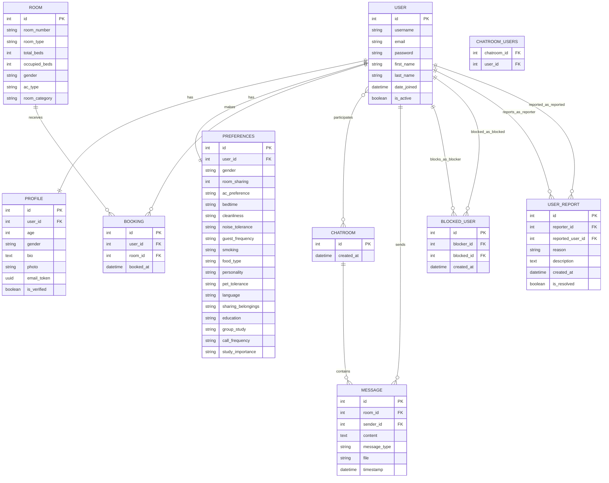

---

## Use Case Diagram

```mermaid
graph TB
    subgraph "RoomieRadar System"
        subgraph "Authentication"
            UC1[Register Account]
            UC2[Login]
            UC3[Verify Email]
            UC4[Logout]
        end

        subgraph "Profile Management"
            UC5[Create Profile]
            UC6[Update Profile]
            UC7[View Profile]
            UC8[Set Preferences]
        end

        subgraph "Room & Booking"
            UC9[Search Rooms]
            UC10[View Room Details]
            UC11[Book Room]
            UC12[View My Bookings]
            UC13[Cancel Booking]
        end

        subgraph "Roommate Matching"
            UC14[Find Matches]
            UC15[View Match Details]
            UC16[Filter Matches]
        end

        subgraph "Chat System"
            UC17[Start Chat]
            UC18[Send Message]
            UC19[Send File]
            UC20[Block User]
            UC21[Report User]
            UC22[View Chat History]
        end

        subgraph "Admin Functions"
            UC23[Manage Users]
            UC24[Manage Rooms]
            UC25[Handle Reports]
        end
    end

    %% Actors
    User((User))
    Admin((Admin))
    System((System))

    %% User interactions
    User --> UC1
    User --> UC2
    User --> UC4
    User --> UC5
    User --> UC6
    User --> UC7
    User --> UC8
    User --> UC9
    User --> UC10
    User --> UC11
    User --> UC12
    User --> UC13
    User --> UC14
    User --> UC15
    User --> UC16
    User --> UC17
    User --> UC18
    User --> UC19
    User --> UC20
    User --> UC21
    User --> UC22

    %% Admin interactions
    Admin --> UC23
    Admin --> UC24
    Admin --> UC25

    %% System interactions
    System --> UC3
```

---

## Sequence Diagrams

### 1. User Registration and Email Verification

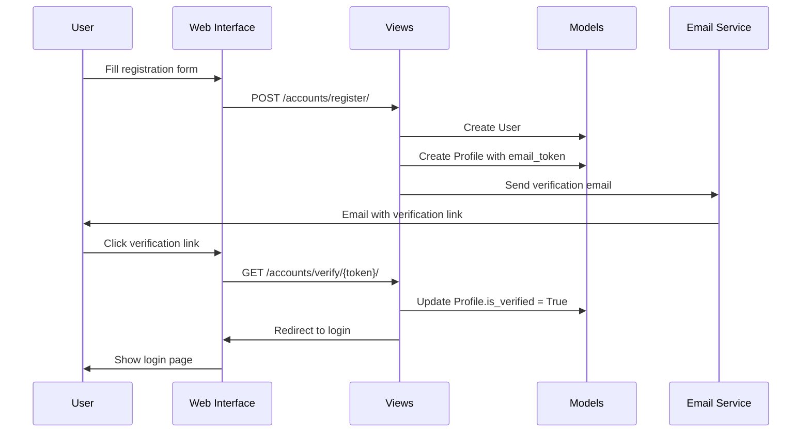

### 2. Roommate Matching Process

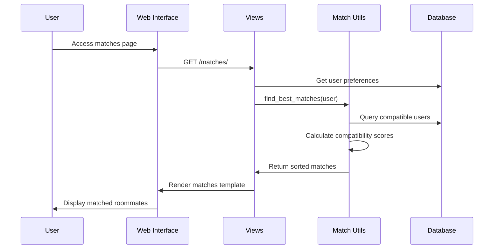

### 3. Chat Message Flow

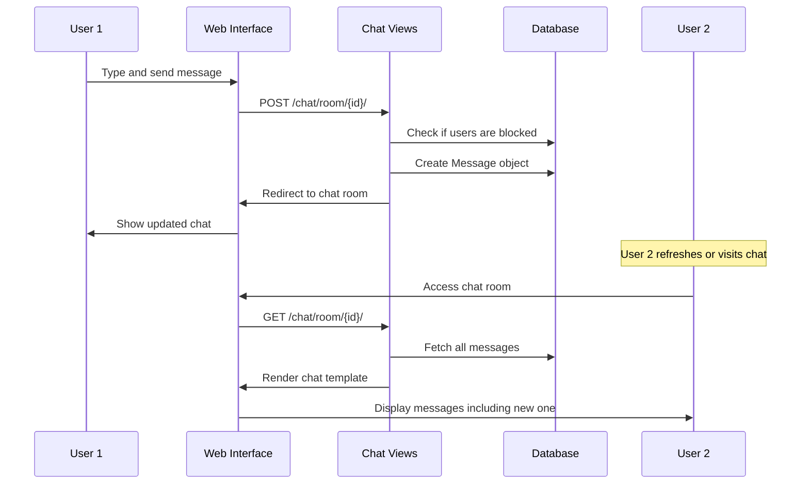

### 4. Room Booking Process

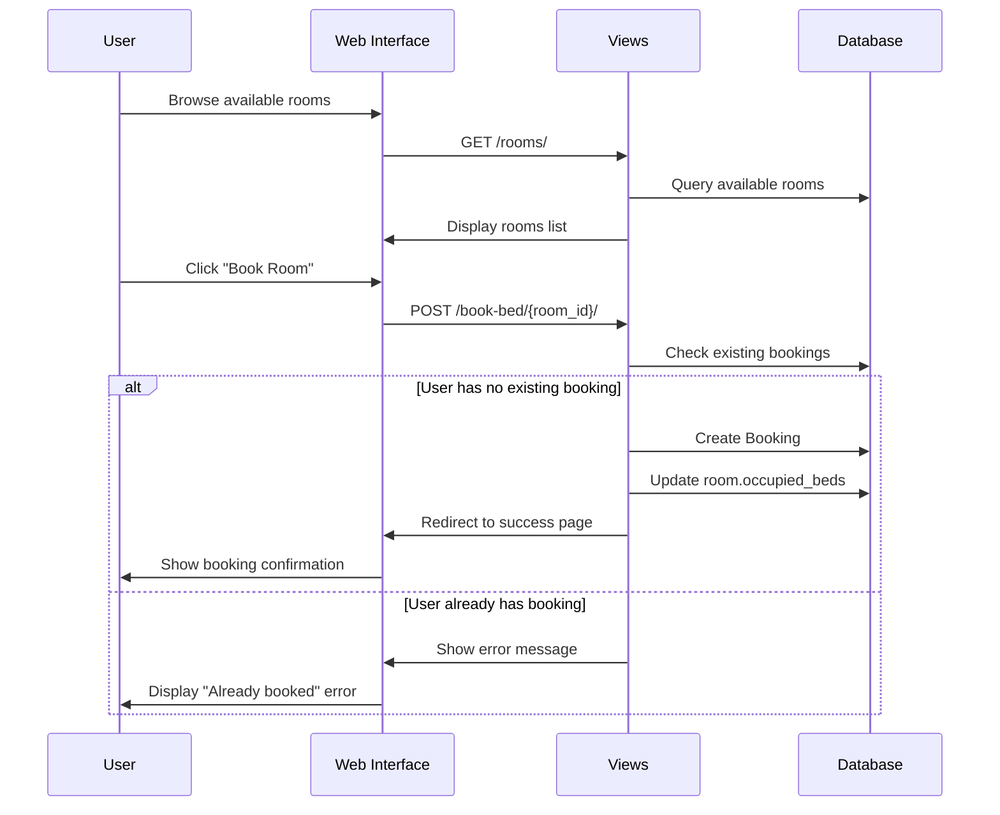

---

## Activity Diagrams

### 1. User Onboarding Flow

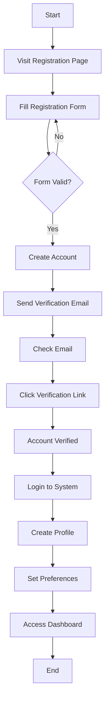

### 2. Room Booking Flow

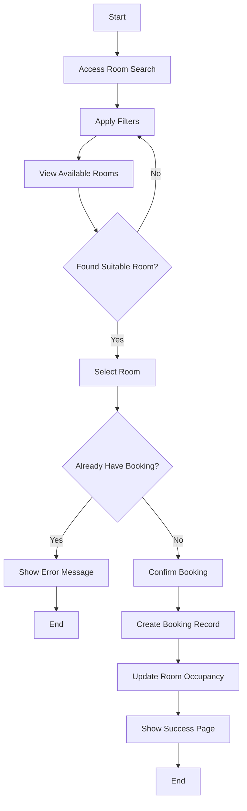

### 3. Chat Interaction Flow

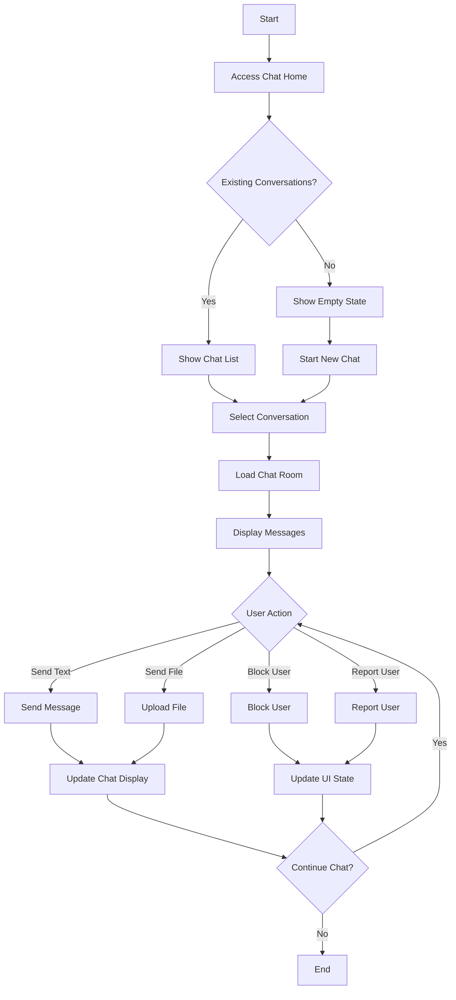

---

## Component Diagram

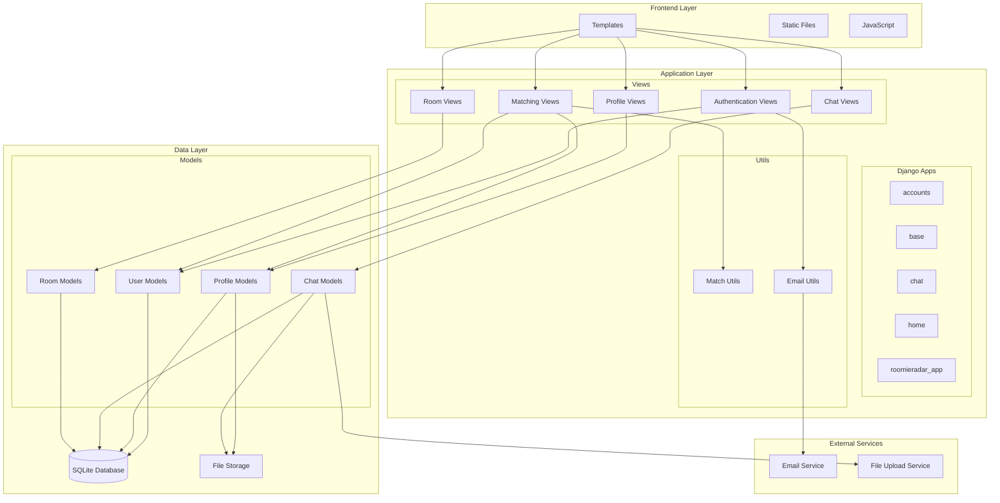

---

## Deployment Diagram

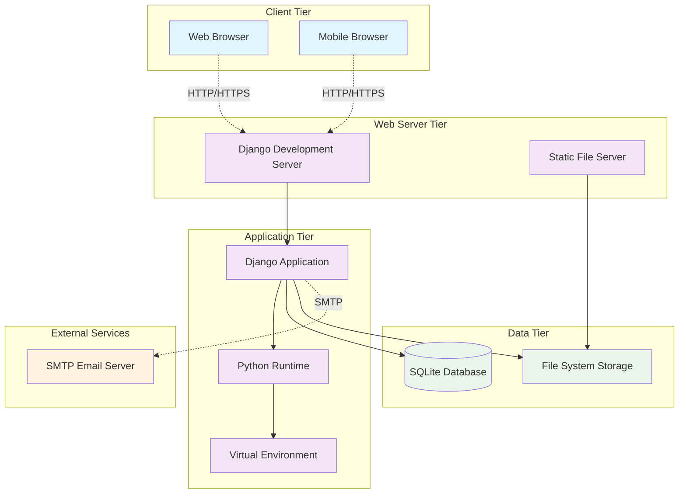

---

## Architecture Overview

### System Architecture Layers

1. **Presentation Layer**
   - HTML Templates with Django Template Language
   - CSS with modern responsive design
   - JavaScript for interactive features
   - Bootstrap/Custom CSS frameworks

2. **Business Logic Layer**
   - Django Views handling HTTP requests
   - Custom utility functions (matching algorithms)
   - Form validation and processing
   - Authentication and authorization

3. **Data Access Layer**
   - Django ORM for database operations
   - Model definitions and relationships
   - Database migrations
   - File upload handling

4. **Data Storage Layer**
   - SQLite database for development
   - File system for media storage
   - Session storage
   - Cache storage (if implemented)

### Key Design Patterns Used

1. **Model-View-Template (MVT)** - Django's architectural pattern
2. **Repository Pattern** - Django ORM acts as repository
3. **Factory Pattern** - Model creation and form handling
4. **Observer Pattern** - Django signals (if used)
5. **Strategy Pattern** - Different matching algorithms

---

## Database Schema Summary

### Core Tables
- **auth_user**: Django's built-in user authentication
- **base_profile**: Extended user profile information
- **base_preferences**: User roommate preferences
- **roomieradar_app_room**: Room inventory
- **roomieradar_app_booking**: Room bookings
- **chat_chatroom**: Chat room instances
- **chat_message**: Chat messages
- **chat_blockeduser**: User blocking relationships
- **chat_userreport**: User reporting system

### Key Relationships
- One-to-One: User ↔ Profile, User ↔ Preferences
- One-to-Many: User → Bookings, Room → Bookings, ChatRoom → Messages
- Many-to-Many: User ↔ ChatRoom (participants)

---

## Notes for Documentation

1. **For Academic Presentation**: Focus on Use Case and Sequence diagrams to show system functionality
2. **For Technical Documentation**: Emphasize Class and Component diagrams for system architecture
3. **For Database Design**: Use ERD to show data relationships and constraints
4. **For System Deployment**: Use Deployment diagram to show infrastructure setup

These UML diagrams provide comprehensive documentation for your RoomieRadar project and can be used in academic presentations, technical documentation, or system design discussions.